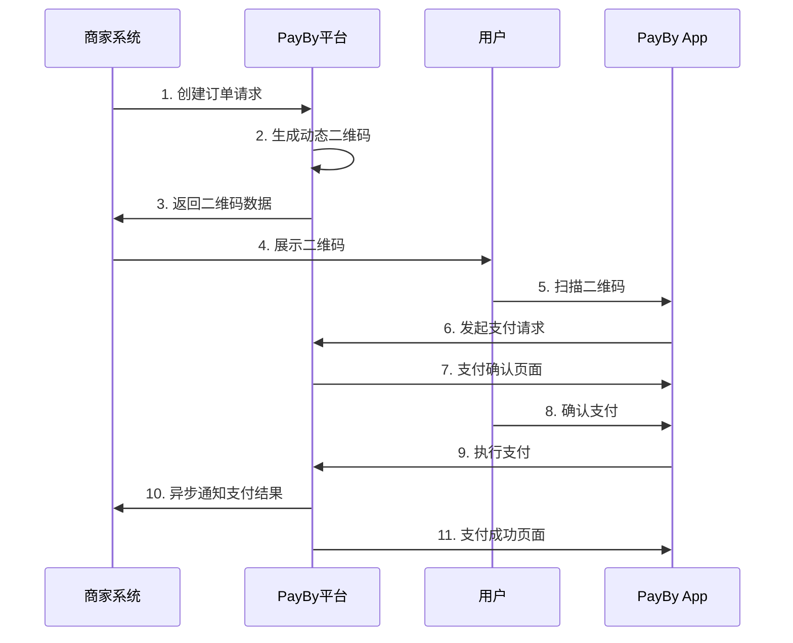
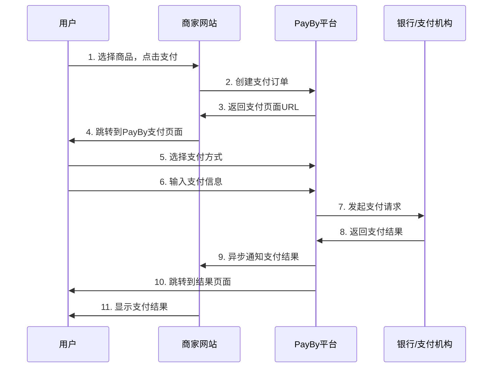

# PayBy支付平台接入文档

## 文档概述

本目录包含了PayBy支付平台的完整接入文档，涵盖了所有支持的支付场景、技术实现方案和最佳实践。

## 文档结构

### 📋 总体文档
- **[PayBy支付平台接入概述](./payby-integration-overview.md)** - 平台简介、支持的支付场景、技术架构
- **[PayBy支付平台接入总结](./payby-integration-summary.md)** - 所有支付场景的对比和总结

### 💳 支付场景文档
- **[动态二维码支付接入指南](./payby-dynqr-payment.md)** - 线下实体店扫码支付
- **[在线支付接入指南](./payby-online-payment.md)** - 电商网站在线支付
- **[退款处理指南](./payby-refund-process.md)** - 订单退款和部分退款
- **[转账服务指南](./payby-transfer-service.md)** - 账户转账和银行转账

### 🔧 技术文档
- **[API接口文档](./payby-api-reference.md)** - 完整的API接口说明

## 快速开始

### 1. 选择支付场景
根据您的业务需求选择合适的支付场景：

| 业务场景 | 推荐支付方式 | 文档链接 |
|----------|--------------|----------|
| 线下实体店 | 动态二维码支付 | [动态二维码支付接入指南](./payby-dynqr-payment.md) |
| 电商网站 | 在线支付 | [在线支付接入指南](./payby-online-payment.md) |
| 售后服务 | 退款处理 | [退款处理指南](./payby-refund-process.md) |
| 资金转移 | 转账服务 | [转账服务指南](./payby-transfer-service.md) |

### 2. 环境准备
```bash
# API认证配置
API_BASE_URL=https://api.payby.com
PRIVATE_KEY=your_private_key
```

### 3. 创建订单示例
```bash
curl -X POST https://api.payby.com/v1/orders \
  -H "Content-Type: application/json" \
  -H "X-PayBy-Signature: {签名}" \
  -H "X-PayBy-Timestamp: {时间戳}" \
  -d '{
    "merchantOrderNo": "ORDER_123456",
    "subject": "测试商品",
    "totalAmount": {
        "currency": "AED",
        "amount": "100.00"
    },
    "paySceneCode": "DYNQR",
    "notifyUrl": "https://yoursite.com/api/notification"
  }'
```

## 支持的支付场景

### 1. 动态二维码支付 (DYNQR)
- **适用场景**: 线下实体店、移动支付
- **特点**: 生成动态二维码，用户扫码支付
- **支付流程**: 商家创建订单 → 生成二维码 → 用户扫码 → 支付确认 → 异步通知

### 2. 在线支付 (ONLINE)
- **适用场景**: 电商网站、移动应用
- **特点**: 支持多种支付方式，包括银行卡、数字钱包、分期付款
- **支付流程**: 用户选择商品 → 创建订单 → 跳转支付页面 → 选择支付方式 → 完成支付

### 3. 退款处理
- **适用场景**: 订单退款、部分退款、批量退款
- **退款类型**: 全额退款、部分退款、自动退款
- **处理流程**: 发起退款 → 验证条件 → 执行退款 → 异步通知

### 4. 转账服务
- **适用场景**: 账户转账、银行转账、批量转账
- **转账类型**: 内部转账、银行转账、跨境转账
- **处理流程**: 发起转账 → 验证条件 → 执行转账 → 异步通知

## 技术特性

### 安全特性
- **私钥认证**: 使用私钥进行API调用认证
- **签名验证**: 支持回调通知签名验证
- **HTTPS通信**: 所有API调用使用HTTPS加密传输
- **数据加密**: 敏感数据传输加密

### API接口规范
- **API基础URL**: `https://api.payby.com`
- **API版本**: v1
- **数据格式**: JSON
- **字符编码**: UTF-8

## 支付流程对比

### 动态二维码支付流程


### 在线支付流程


## 最佳实践

### 1. 错误处理
```php
try {
    $order = \PayBy\Api\Order::placeOrder($orderData);
} catch (\PayBy\Error\InvalidRequest $e) {
    // 参数错误
    log_error('Invalid request: ' . $e->getMessage());
} catch (\PayBy\Error\Authentication $e) {
    // 认证错误
    log_error('Authentication failed: ' . $e->getMessage());
} catch (\PayBy\Error\Base $e) {
    // 其他错误
    log_error('PayBy error: ' . $e->getMessage());
}
```

### 2. 异步通知处理
```php
// 处理支付结果通知
if ($_SERVER['REQUEST_METHOD'] === 'POST') {
    $input = file_get_contents('php://input');
    $data = json_decode($input, true);
    
    // 验证签名
    $signature = $_SERVER['HTTP_X_PAYBY_SIGNATURE'] ?? '';
    if (!verifySignature($data, $signature)) {
        http_response_code(400);
        exit;
    }
    
    // 处理支付结果
    $status = $data['status'];
    switch ($status) {
        case 'SUCCESS':
            // 支付成功处理
            break;
        case 'FAILED':
            // 支付失败处理
            break;
    }
    
    echo json_encode(['status' => 'success']);
}
```

## 测试环境

### 测试配置
```bash
# 测试环境API地址
API_BASE_URL=https://test-api.payby.com
TEST_PRIVATE_KEY=your_test_private_key
```

### 测试用例
1. **正常支付流程测试**
2. **支付失败测试**
3. **退款处理测试**
4. **转账服务测试**
5. **网络异常测试**
6. **重复支付测试**

## 常见问题

### Q1: 如何选择合适的支付场景？
**A**: 
- 线下实体店选择动态二维码支付
- 电商网站选择在线支付
- 需要退款功能时使用退款处理
- 需要资金转移时使用转账服务

### Q2: 如何处理支付失败？
**A**: 
- 检查网络连接
- 验证API参数
- 查看错误日志
- 联系技术支持

### Q3: 如何确保支付安全？
**A**: 
- 使用HTTPS通信
- 验证签名
- 设置支付限额
- 监控异常交易

## 相关资源

### 官方资源
- **官方网站**: https://payby.com
- **开发者文档**: https://developers.payby.com/docs/integration-guide
- **API文档**: https://developers.payby.com/docs/api
- **技术支持**: support@payby.com

### API文档
- **API基础URL**: https://api.payby.com
- **API版本**: v1
- **数据格式**: JSON
- **字符编码**: UTF-8

## 更新日志

### v1.0.0 (2024-01-01)
- 初始版本发布
- 支持订单、退款、转账功能
- 提供完整的API文档

### v1.1.0 (2024-02-01)
- 新增批量转账功能
- 优化错误处理机制
- 增加更多支付方式支持

### v1.2.0 (2024-03-01)
- 新增跨境转账功能
- 优化签名算法
- 增加限流保护机制

## 贡献指南

如果您发现文档中的错误或有改进建议，请：

1. 提交Issue到技术支持邮箱
2. 发送邮件到技术支持邮箱
3. 联系我们的开发团队

## 许可证

本文档采用MIT许可证，详见LICENSE文件。

---

**注意**: 本文档基于PayBy支付平台的最新版本编写，如有更新请参考官方文档。 