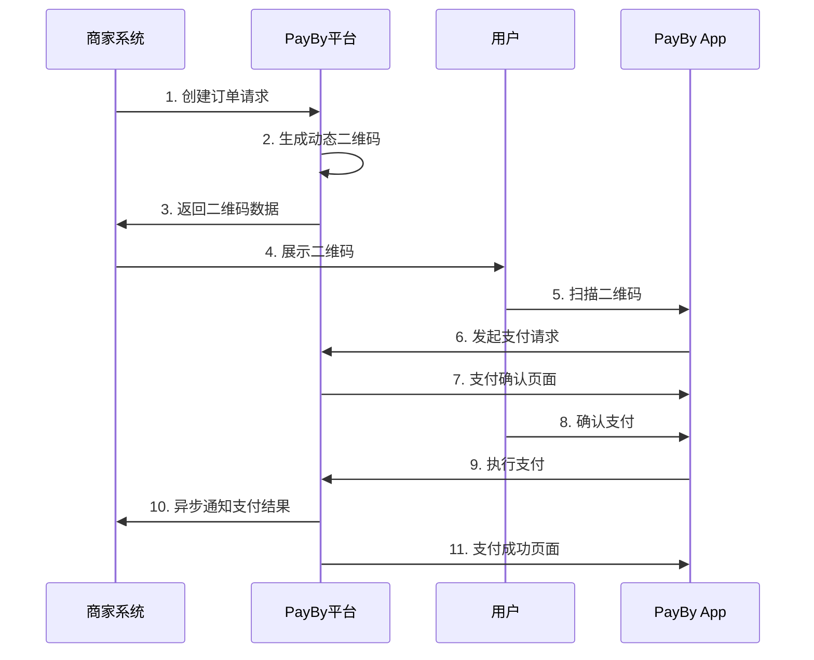

# PayBy动态二维码支付接入指南

## 概述

动态二维码支付(DYNQR)是PayBy平台的核心支付方式之一，适用于线下实体店、移动支付等场景。商家生成动态二维码，用户通过PayBy应用扫码完成支付。

**场景代码**: `DYNQR`  
**适用场景**: 线下实体店、移动支付、面对面交易

## 支付流程



## 技术实现

### 1. 环境准备

#### API认证配置
所有API请求都需要使用私钥进行签名认证。

#### 请求头设置
```
Content-Type: application/json
X-PayBy-Signature: {签名}
X-PayBy-Timestamp: {时间戳}
```

### 2. 创建订单

#### 基本订单创建
```bash
curl -X POST https://api.payby.com/v1/orders \
  -H "Content-Type: application/json" \
  -H "X-PayBy-Signature: {签名}" \
  -H "X-PayBy-Timestamp: {时间戳}" \
  -d '{
    "merchantOrderNo": "ORDER_123456",
    "subject": "iPhone 15 Pro",
    "totalAmount": {
        "currency": "AED",
        "amount": "3999.00"
    },
    "paySceneCode": "DYNQR",
    "notifyUrl": "https://yoursite.com/api/payby/notification",
    "accessoryContent": {
        "amountDetail": {
            "vatAmount": {
                "currency": "AED",
                "amount": "199.95"
            }
        },
        "goodsDetail": {
            "body": "电子产品",
            "goodsName": "iPhone 15 Pro 256GB",
            "goodsId": "IPHONE15PRO256"
        },
        "terminalDetail": {
            "merchantName": "科技数码店"
        }
    }
  }'
```

#### 订单参数说明

| 参数名 | 类型 | 必填 | 说明 |
|--------|------|------|------|
| merchantOrderNo | string | 是 | 商户订单号，唯一标识 |
| subject | string | 是 | 订单标题/商品名称 |
| totalAmount | object | 是 | 订单总金额 |
| totalAmount.currency | string | 是 | 货币代码，如AED |
| totalAmount.amount | string | 是 | 金额，字符串格式 |
| paySceneCode | string | 是 | 支付场景代码，固定为"DYNQR" |
| notifyUrl | string | 是 | 异步通知URL |
| accessoryContent | object | 否 | 附加信息 |

### 3. 处理二维码展示

#### 获取二维码数据
```php
// 从订单响应中获取二维码信息
$qrCodeData = $order['qrCodeData']; // 二维码数据
$qrCodeUrl = $order['qrCodeUrl'];   // 二维码图片URL
$orderId = $order['orderId'];       // PayBy订单ID
```

#### 前端展示示例
```html
<!DOCTYPE html>
<html>
<head>
    <title>扫码支付</title>
    <meta charset="utf-8">
    <meta name="viewport" content="width=device-width, initial-scale=1">
</head>
<body>
    <div class="payment-container">
        <h2>请使用PayBy App扫码支付</h2>
        <div class="qr-code">
            " alt="支付二维码">
        </div>
        <div class="order-info">
            <p>订单号: <?php echo $order_no; ?></p>
            <p>金额: AED <?php echo $totalAmount; ?></p>
            <p>商品: <?php echo $subject; ?></p>
        </div>
        <div class="payment-status" id="status">
            等待支付...
        </div>
    </div>
    
    <script>
        // 轮询支付状态
        function checkPaymentStatus() {
            fetch('/api/payby/check-status?orderId=<?php echo $orderId; ?>')
                .then(response => response.json())
                .then(data => {
                    if (data.status === 'SUCCESS') {
                        document.getElementById('status').innerHTML = '支付成功！';
                        // 跳转到成功页面
                        setTimeout(() => {
                            window.location.href = '/payment/success';
                        }, 2000);
                    } else if (data.status === 'FAILED') {
                        document.getElementById('status').innerHTML = '支付失败';
                    }
                });
        }
        
        // 每3秒检查一次支付状态
        setInterval(checkPaymentStatus, 3000);
    </script>
</body>
</html>
```

### 4. 异步通知处理

#### 通知接口实现
```php
<?php
// /api/payby/notification.php

// 验证签名
function verifySignature($data, $signature) {
    // TODO: 实现签名验证逻辑
    return true;
}

// 处理异步通知
if ($_SERVER['REQUEST_METHOD'] === 'POST') {
    $input = file_get_contents('php://input');
    $data = json_decode($input, true);
    
    // 验证签名
    $signature = $_SERVER['HTTP_X_PAYBY_SIGNATURE'] ?? '';
    if (!verifySignature($data, $signature)) {
        http_response_code(400);
        echo json_encode(['error' => 'Invalid signature']);
        exit;
    }
    
    // 处理支付结果
    $orderId = $data['orderId'];
    $merchantOrderNo = $data['merchantOrderNo'];
    $status = $data['status'];
    $amount = $data['amount'];
    
    switch ($status) {
        case 'SUCCESS':
            // 支付成功，更新订单状态
            updateOrderStatus($merchantOrderNo, 'paid');
            // 发送成功通知给用户
            sendSuccessNotification($merchantOrderNo);
            break;
            
        case 'FAILED':
            // 支付失败，更新订单状态
            updateOrderStatus($merchantOrderNo, 'failed');
            // 发送失败通知给用户
            sendFailureNotification($merchantOrderNo);
            break;
            
        case 'CANCELLED':
            // 支付取消，更新订单状态
            updateOrderStatus($merchantOrderNo, 'cancelled');
            break;
    }
    
    // 返回成功响应
    echo json_encode(['status' => 'success']);
}
```

### 5. 查询订单状态

#### 查询订单接口
```bash
curl -X GET https://api.payby.com/v1/orders/{orderId} \
  -H "Content-Type: application/json" \
  -H "X-PayBy-Signature: {签名}" \
  -H "X-PayBy-Timestamp: {时间戳}"
```

### 6. 取消订单

#### 取消订单接口
```bash
curl -X POST https://api.payby.com/v1/orders/{orderId}/cancel \
  -H "Content-Type: application/json" \
  -H "X-PayBy-Signature: {签名}" \
  -H "X-PayBy-Timestamp: {时间戳}" \
  -d '{
    "cancelReason": "客户取消"
  }'
```

## 最佳实践

### 1. 错误处理
```json
{
    "code": "ERROR_CODE",
    "message": "错误描述",
    "data": null,
    "timestamp": "2024-01-01T12:00:00Z"
}
```

常见错误码：
- `INVALID_PARAMETER`: 参数错误
- `AUTHENTICATION_FAILED`: 认证失败
- `API_CONNECTION_ERROR`: 网络连接错误
- `SYSTEM_ERROR`: 系统错误

### 2. 订单号生成
建议使用时间戳和随机数生成唯一订单号，格式如：`ORDER_20240101120000_1234`

### 3. 金额处理
金额必须使用字符串格式，保留两位小数，如：`"100.00"`

### 4. 日志记录
建议记录所有API请求和响应，便于问题排查和审计

## 测试环境

### 测试配置
```bash
# 测试环境API地址
API_BASE_URL=https://test-api.payby.com
TEST_PRIVATE_KEY=your_test_private_key
```

### 测试用例
1. **正常支付流程测试**
2. **支付失败测试**
3. **订单取消测试**
4. **网络异常测试**
5. **重复支付测试**

## 常见问题

### Q1: 二维码显示异常
**A**: 检查二维码URL是否可访问，确保图片格式正确。

### Q2: 支付状态查询失败
**A**: 确认订单ID格式正确，检查网络连接。

### Q3: 异步通知未收到
**A**: 验证notifyUrl是否可访问，检查服务器防火墙设置。

### Q4: 签名验证失败
**A**: 确认私钥配置正确，检查签名算法实现。

## 相关接口文档

- **创建订单**: https://developers.payby.com/docs/api/orders/create
- **查询订单**: https://developers.payby.com/docs/api/orders/retrieve
- **取消订单**: https://developers.payby.com/docs/api/orders/cancel
- **异步通知**: https://developers.payby.com/docs/api/notifications

## 技术支持

- **开发者文档**: https://developers.payby.com/docs
- **API文档**: https://developers.payby.com/docs/api
- **技术支持**: support@payby.com 