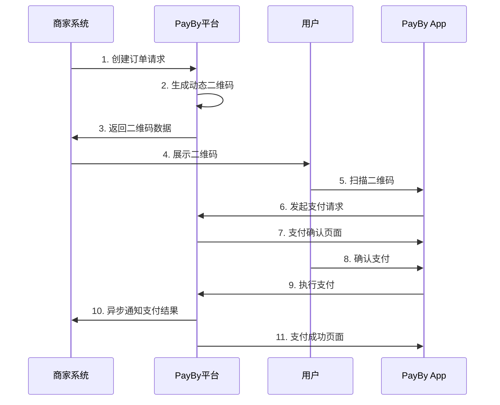
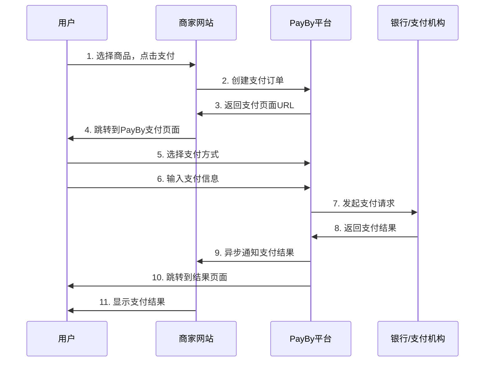
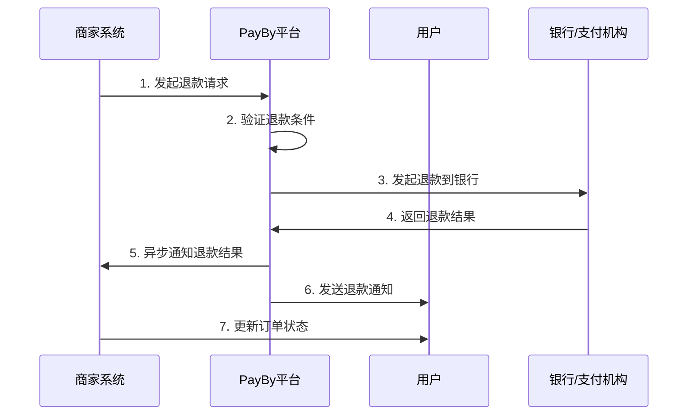
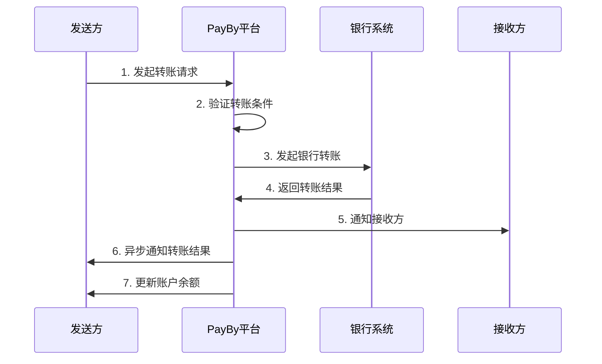

# PayBy支付平台接入总结

## 平台概述

PayBy是一家专注于阿联酋市场的数字支付解决方案提供商，为商家提供安全、便捷的无现金支付服务。平台支持多种支付场景，包括动态二维码支付、在线支付、退款处理和转账服务。

**官方网站**: https://payby.com  
**开发者文档**: https://developers.payby.com/docs/integration-guide  
**API文档**: https://developers.payby.com/docs/api

## 支持的支付场景

### 1. 动态二维码支付 (DYNQR)
- **场景代码**: `DYNQR`
- **适用场景**: 线下实体店、移动支付、面对面交易
- **特点**: 生成动态二维码，用户扫码支付
- **支付流程**: 商家创建订单 → 生成二维码 → 用户扫码 → 支付确认 → 异步通知
- **详细文档**: [动态二维码支付接入指南](./payby-dynqr-payment.md)

### 2. 在线支付 (ONLINE)
- **场景代码**: `ONLINE`
- **适用场景**: 电商网站、移动应用、在线服务
- **特点**: 支持多种支付方式，包括银行卡、数字钱包、分期付款
- **支付流程**: 用户选择商品 → 创建订单 → 跳转支付页面 → 选择支付方式 → 完成支付
- **详细文档**: [在线支付接入指南](./payby-online-payment.md)

### 3. 退款处理
- **适用场景**: 订单退款、部分退款、批量退款
- **退款类型**: 全额退款、部分退款、自动退款
- **处理流程**: 发起退款 → 验证条件 → 执行退款 → 异步通知
- **详细文档**: [退款处理指南](./payby-refund-process.md)

### 4. 转账服务
- **适用场景**: 账户转账、银行转账、批量转账
- **转账类型**: 内部转账、银行转账、跨境转账
- **处理流程**: 发起转账 → 验证条件 → 执行转账 → 异步通知
- **详细文档**: [转账服务指南](./payby-transfer-service.md)

## 技术架构

### API接口规范
- **API基础URL**: `https://api.payby.com`
- **API版本**: v1
- **数据格式**: JSON
- **字符编码**: UTF-8

### 核心功能
1. **订单管理**: 创建、查询、取消订单
2. **支付处理**: 多种支付场景支持
3. **退款管理**: 退款申请和查询
4. **转账服务**: 内部转账和银行转账
5. **通知回调**: 异步支付结果通知

### 安全特性
- **私钥认证**: 使用私钥进行API调用认证
- **签名验证**: 支持回调通知签名验证
- **HTTPS通信**: 所有API调用使用HTTPS加密传输
- **数据加密**: 敏感数据传输加密

## 接入方式对比

| 接入方式 | 适用场景 | 复杂度 | 用户体验 | 安全性 |
|----------|----------|--------|----------|--------|
| 动态二维码支付 | 线下实体店 | 中等 | 良好 | 高 |
| 在线支付 | 电商网站 | 中等 | 优秀 | 高 |
| 退款处理 | 售后服务 | 简单 | 良好 | 高 |
| 转账服务 | 资金转移 | 复杂 | 良好 | 高 |

## 支付流程对比

### 动态二维码支付流程


### 在线支付流程


### 退款处理流程


### 转账服务流程


## 技术实现要点

### 1. 环境准备
```bash
# 安装SDK
# API认证配置
API_BASE_URL=https://api.payby.com
PRIVATE_KEY=your_private_key

# 初始化配置
# 设置API认证信息
```

### 2. 订单创建示例
```php
// 动态二维码支付
$order = \PayBy\Api\Order::placeOrder([
    "merchantOrderNo" => "ORDER_123456",
    "subject" => "商品名称",
    'totalAmount' => [
        'currency' => 'AED',
        'amount' => '100.00',
    ],
    "paySceneCode" => "DYNQR",
    "notifyUrl" => "https://yoursite.com/api/notification",
]);

// 在线支付
$order = \PayBy\Api\Order::placeOrder([
    "merchantOrderNo" => "ORDER_123456",
    "subject" => "商品名称",
    'totalAmount' => [
        'currency' => 'AED',
        'amount' => '100.00',
    ],
    "paySceneCode" => "ONLINE",
    "notifyUrl" => "https://yoursite.com/api/notification",
    "returnUrl" => "https://yoursite.com/payment/result",
]);
```

### 3. 异步通知处理
```php
// 处理支付结果通知
if ($_SERVER['REQUEST_METHOD'] === 'POST') {
    $input = file_get_contents('php://input');
    $data = json_decode($input, true);
    
    // 验证签名
    $signature = $_SERVER['HTTP_X_PAYBY_SIGNATURE'] ?? '';
    if (!verifySignature($data, $signature)) {
        http_response_code(400);
        exit;
    }
    
    // 处理支付结果
    $status = $data['status'];
    switch ($status) {
        case 'SUCCESS':
            // 支付成功处理
            break;
        case 'FAILED':
            // 支付失败处理
            break;
    }
    
    echo json_encode(['status' => 'success']);
}
```

## 最佳实践

### 1. 错误处理
```php
try {
    $order = \PayBy\Api\Order::placeOrder($orderData);
} catch (\PayBy\Error\InvalidRequest $e) {
    // 参数错误
    log_error('Invalid request: ' . $e->getMessage());
} catch (\PayBy\Error\Authentication $e) {
    // 认证错误
    log_error('Authentication failed: ' . $e->getMessage());
} catch (\PayBy\Error\Base $e) {
    // 其他错误
    log_error('PayBy error: ' . $e->getMessage());
}
```

### 2. 订单号生成
```php
function generateOrderNo() {
    return 'ORDER_' . date('YmdHis') . '_' . mt_rand(1000, 9999);
}
```

### 3. 金额处理
```php
function formatAmount($amount) {
    return number_format($amount, 2, '.', '');
}
```

### 4. 日志记录
```php
function logPayment($orderNo, $action, $data) {
    $log = [
        'timestamp' => date('Y-m-d H:i:s'),
        'order_no' => $orderNo,
        'action' => $action,
        'data' => $data
    ];
    
    file_put_contents(
        'logs/payment.log',
        json_encode($log) . "\n",
        FILE_APPEND
    );
}
```

## 安全考虑

### 1. 签名验证
- 所有API调用都需要签名验证
- 异步通知必须验证签名
- 使用RSA算法进行签名

### 2. 数据加密
- 敏感数据传输使用HTTPS
- 私钥安全存储
- 定期更新密钥

### 3. 风险控制
- 设置合理的支付限额
- 监控异常交易
- 实施防重复支付机制

## 测试环境

### 测试配置
```bash
# 测试环境API地址
API_BASE_URL=https://test-api.payby.com
TEST_PRIVATE_KEY=your_test_private_key
```

### 测试用例
1. **正常支付流程测试**
2. **支付失败测试**
3. **退款处理测试**
4. **转账服务测试**
5. **网络异常测试**
6. **重复支付测试**

## 常见问题

### Q1: 如何选择合适的支付场景？
**A**: 
- 线下实体店选择动态二维码支付
- 电商网站选择在线支付
- 需要退款功能时使用退款处理
- 需要资金转移时使用转账服务

### Q2: 如何处理支付失败？
**A**: 
- 检查网络连接
- 验证API参数
- 查看错误日志
- 联系技术支持

### Q3: 如何确保支付安全？
**A**: 
- 使用HTTPS通信
- 验证签名
- 设置支付限额
- 监控异常交易

### Q4: 如何优化用户体验？
**A**: 
- 提供多种支付方式
- 优化支付页面
- 及时处理异步通知
- 提供清晰的错误提示

## 相关文档

- [PayBy支付平台接入概述](./payby-integration-overview.md)
- [动态二维码支付接入指南](./payby-dynqr-payment.md)
- [在线支付接入指南](./payby-online-payment.md)
- [退款处理指南](./payby-refund-process.md)
- [转账服务指南](./payby-transfer-service.md)
- [API接口文档](./payby-api-reference.md)

## 技术支持

- **开发者文档**: https://developers.payby.com/docs
- **API文档**: https://developers.payby.com/docs/api
- **技术支持**: support@payby.com
- **API状态监控**: https://status.payby.com

## 总结

PayBy支付平台提供了完整的支付解决方案，支持多种支付场景和接入方式。通过合理的架构设计和安全机制，为商家和用户提供安全、便捷的支付体验。

选择合适的支付场景、正确实现技术接口、做好安全防护和用户体验优化，是成功接入PayBy支付平台的关键要素。 