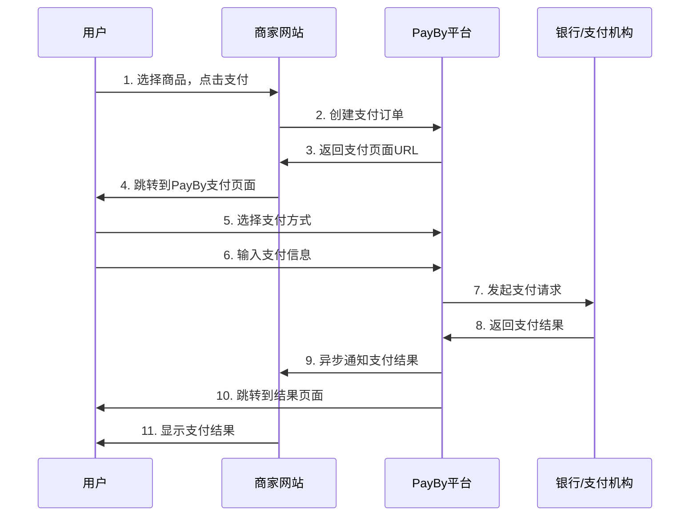

# PayBy在线支付接入指南

## 概述

PayBy在线支付适用于电商网站、移动应用等线上支付场景，支持多种支付方式，为用户提供便捷的在线支付体验。

**适用场景**: 电商网站、移动应用、在线服务  
**支付方式**: 银行卡、数字钱包、分期付款等

## 支付流程



## 技术实现

### 1. 环境准备

#### API认证配置
所有API请求都需要使用私钥进行签名认证。

#### 请求头设置
```
Content-Type: application/json
X-PayBy-Signature: {签名}
X-PayBy-Timestamp: {时间戳}
```

### 2. 创建支付订单

#### 基本支付订单创建
```bash
curl -X POST https://api.payby.com/v1/orders \
  -H "Content-Type: application/json" \
  -H "X-PayBy-Signature: {签名}" \
  -H "X-PayBy-Timestamp: {时间戳}" \
  -d '{
    "merchantOrderNo": "ORDER_123456",
    "subject": "在线购物订单",
    "totalAmount": {
        "currency": "AED",
        "amount": "299.99"
    },
    "paySceneCode": "ONLINE",
    "notifyUrl": "https://yoursite.com/api/payby/notification",
    "returnUrl": "https://yoursite.com/payment/result",
    "accessoryContent": {
        "amountDetail": {
            "vatAmount": {
                "currency": "AED",
                "amount": "15.00"
            },
            "discountAmount": {
                "currency": "AED",
                "amount": "20.00"
            }
        },
        "goodsDetail": {
            "body": "电子产品",
            "goodsName": "无线蓝牙耳机",
            "goodsId": "BT_HEADPHONE_001",
            "quantity": 1,
            "unitPrice": {
                "currency": "AED",
                "amount": "299.99"
            }
        },
        "buyerDetail": {
            "buyerName": "张三",
            "buyerEmail": "zhangsan@example.com",
            "buyerPhone": "+971501234567"
        },
        "shippingDetail": {
            "shippingAddress": {
                "country": "AE",
                "state": "Dubai",
                "city": "Dubai",
                "address": "123 Main Street",
                "postalCode": "12345"
            }
        }
    }
  }'
```

#### 订单参数说明

| 参数名 | 类型 | 必填 | 说明 |
|--------|------|------|------|
| merchantOrderNo | string | 是 | 商户订单号，唯一标识 |
| subject | string | 是 | 订单标题/商品名称 |
| totalAmount | object | 是 | 订单总金额 |
| paySceneCode | string | 是 | 支付场景代码，在线支付为"ONLINE" |
| notifyUrl | string | 是 | 异步通知URL |
| returnUrl | string | 是 | 支付完成后的跳转URL |
| accessoryContent | object | 否 | 附加信息 |

### 3. 支付页面集成

#### 直接跳转方式
```php
<?php
// 创建订单后直接跳转到PayBy支付页面
$paymentUrl = $paymentOrder['paymentUrl'];
?>
<!DOCTYPE html>
<html>
<head>
    <title>跳转到支付页面</title>
    <meta charset="utf-8">
</head>
<body>
    <div class="loading">
        <p>正在跳转到支付页面...</p>
        <p>如果没有自动跳转，请<a href="<?php echo $paymentUrl; ?>">点击这里</a></p>
    </div>
    
    <script>
        // 自动跳转到支付页面
        window.location.href = '<?php echo $paymentUrl; ?>';
    </script>
</body>
</html>
```

#### 嵌入式支付页面
```html
<!DOCTYPE html>
<html>
<head>
    <title>在线支付</title>
    <meta charset="utf-8">
    <meta name="viewport" content="width=device-width, initial-scale=1">
    <style>
        .payment-container {
            max-width: 800px;
            margin: 0 auto;
            padding: 20px;
        }
        .payment-iframe {
            width: 100%;
            height: 600px;
            border: 1px solid #ddd;
            border-radius: 8px;
        }
    </style>
</head>
<body>
    <div class="payment-container">
        <h2>订单支付</h2>
        <div class="order-summary">
            <p>订单号: <?php echo $order_no; ?></p>
            <p>金额: AED <?php echo $totalAmount; ?></p>
            <p>商品: <?php echo $subject; ?></p>
        </div>
        
        <iframe 
            src="<?php echo $paymentUrl; ?>" 
            class="payment-iframe"
            frameborder="0"
            allowfullscreen>
        </iframe>
    </div>
    
    <script>
        // 监听支付结果
        window.addEventListener('message', function(event) {
            if (event.origin !== 'https://payby.com') {
                return;
            }
            
            if (event.data.type === 'payment_result') {
                handlePaymentResult(event.data);
            }
        });
        
        function handlePaymentResult(data) {
            if (data.status === 'SUCCESS') {
                window.location.href = '/payment/success?orderId=' + data.orderId;
            } else if (data.status === 'FAILED') {
                window.location.href = '/payment/failed?orderId=' + data.orderId;
            }
        }
    </script>
</body>
</html>
```

### 4. 支付结果处理

#### 同步返回处理
```php
<?php
// /payment/result.php

// 处理PayBy同步返回
if (isset($_GET['orderId'])) {
    $orderId = $_GET['orderId'];
    $status = $_GET['status'] ?? '';
    
    // 查询订单状态确认支付结果
    $orderStatus = queryOrderStatus($orderId);
    $paymentStatus = $orderStatus['status'];
    
    if ($paymentStatus === 'SUCCESS') {
        // 支付成功页面
        include 'payment-success.php';
    } else {
        // 支付失败页面
        include 'payment-failed.php';
    }
}
?>
```

#### 支付成功页面
```php
<?php
// payment-success.php
?>
<!DOCTYPE html>
<html>
<head>
    <title>支付成功</title>
    <meta charset="utf-8">
    <style>
        .success-container {
            text-align: center;
            padding: 50px 20px;
        }
        .success-icon {
            color: #52c41a;
            font-size: 64px;
            margin-bottom: 20px;
        }
    </style>
</head>
<body>
    <div class="success-container">
        <div class="success-icon">✓</div>
        <h1>支付成功！</h1>
        <p>您的订单已支付成功，我们会尽快为您发货。</p>
        <p>订单号: <?php echo $orderId; ?></p>
        <div class="actions">
            <a href="/orders" class="btn">查看订单</a>
            <a href="/" class="btn">继续购物</a>
        </div>
    </div>
</body>
</html>
```

### 5. 异步通知处理

#### 通知接口实现
```php
<?php
// /api/payby/notification.php

// 验证签名
function verifySignature($data, $signature) {
    // TODO: 实现签名验证逻辑
    return true;
}

// 处理异步通知
if ($_SERVER['REQUEST_METHOD'] === 'POST') {
    $input = file_get_contents('php://input');
    $data = json_decode($input, true);
    
    // 验证签名
    $signature = $_SERVER['HTTP_X_PAYBY_SIGNATURE'] ?? '';
    if (!verifySignature($data, $signature)) {
        http_response_code(400);
        echo json_encode(['error' => 'Invalid signature']);
        exit;
    }
    
    // 处理支付结果
    $orderId = $data['orderId'];
    $merchantOrderNo = $data['merchantOrderNo'];
    $status = $data['status'];
    $amount = $data['amount'];
    $paymentMethod = $data['paymentMethod'] ?? '';
    
    switch ($status) {
        case 'SUCCESS':
            // 支付成功处理
            processPaymentSuccess($merchantOrderNo, $orderId, $amount, $paymentMethod);
            break;
            
        case 'FAILED':
            // 支付失败处理
            processPaymentFailure($merchantOrderNo, $orderId, $data['failureReason'] ?? '');
            break;
            
        case 'CANCELLED':
            // 支付取消处理
            processPaymentCancellation($merchantOrderNo, $orderId);
            break;
            
        case 'PENDING':
            // 支付处理中
            processPaymentPending($merchantOrderNo, $orderId);
            break;
    }
    
    // 返回成功响应
    echo json_encode(['status' => 'success']);
}

function processPaymentSuccess($merchantOrderNo, $orderId, $amount, $paymentMethod) {
    // 更新订单状态
    updateOrderStatus($merchantOrderNo, 'paid');
    
    // 记录支付信息
    recordPaymentInfo($merchantOrderNo, $orderId, $amount, $paymentMethod);
    
    // 发送成功通知
    sendPaymentSuccessNotification($merchantOrderNo);
    
    // 触发后续业务逻辑
    triggerPostPaymentActions($merchantOrderNo);
}

function processPaymentFailure($merchantOrderNo, $orderId, $failureReason) {
    // 更新订单状态
    updateOrderStatus($merchantOrderNo, 'failed');
    
    // 记录失败原因
    recordPaymentFailure($merchantOrderNo, $failureReason);
    
    // 发送失败通知
    sendPaymentFailureNotification($merchantOrderNo);
}
```

### 6. 支付方式配置

#### 支持的支付方式
```php
<?php
// 配置支持的支付方式
$paymentMethods = [
    'CREDIT_CARD' => [
        'name' => '信用卡',
        'enabled' => true,
        'currencies' => ['AED', 'USD'],
    ],
    'DEBIT_CARD' => [
        'name' => '借记卡',
        'enabled' => true,
        'currencies' => ['AED'],
    ],
    'DIGITAL_WALLET' => [
        'name' => '数字钱包',
        'enabled' => true,
        'currencies' => ['AED'],
    ],
    'INSTALLMENT' => [
        'name' => '分期付款',
        'enabled' => true,
        'currencies' => ['AED'],
        'terms' => [3, 6, 12], // 分期期数
    ],
];

// 创建订单时指定支付方式
$orderData = [
    // ... 其他参数
    'paymentMethod' => 'CREDIT_CARD', // 指定支付方式
    'installmentTerm' => 6, // 如果选择分期付款，指定期数
];
```

### 7. 分期付款处理

#### 分期付款订单创建
```php
<?php
// 创建分期付款订单
$installmentOrder = \PayBy\Api\Order::placeOrder([
    "merchantOrderNo" => $order_no,
    "subject" => "iPhone 15 Pro - 分期付款",
    'totalAmount' => [
        'currency' => 'AED',
        'amount' => '3999.00',
    ],
    "paySceneCode" => "ONLINE",
    "paymentMethod" => "INSTALLMENT",
    "installmentTerm" => 12, // 12期分期
    "notifyUrl" => "https://yoursite.com/api/payby/notification",
    "returnUrl" => "https://yoursite.com/payment/result",
    "accessoryContent" => [
        'installmentDetail' => [
            'monthlyAmount' => [
                'currency' => 'AED',
                'amount' => '333.25', // 3999/12
            ],
            'totalInterest' => [
                'currency' => 'AED',
                'amount' => '0.00', // 无利息
            ],
        ],
    ],
]);
```

## 最佳实践

### 1. 订单状态管理
```php
<?php
// 订单状态枚举
class OrderStatus {
    const PENDING = 'pending';      // 待支付
    const PAID = 'paid';           // 已支付
    const FAILED = 'failed';       // 支付失败
    const CANCELLED = 'cancelled'; // 已取消
    const REFUNDED = 'refunded';   // 已退款
}

// 更新订单状态
function updateOrderStatus($orderNo, $status, $additionalData = []) {
    $updateData = [
        'status' => $status,
        'updated_at' => date('Y-m-d H:i:s'),
    ];
    
    if (!empty($additionalData)) {
        $updateData = array_merge($updateData, $additionalData);
    }
    
    // 更新数据库
    $db->update('orders', $updateData, ['order_no' => $orderNo]);
    
    // 记录状态变更日志
    logOrderStatusChange($orderNo, $status, $additionalData);
}
```

### 2. 支付安全验证
```php
<?php
// 支付金额验证
function validatePaymentAmount($orderNo, $paidAmount) {
    $order = getOrderByNo($orderNo);
    
    if (!$order) {
        throw new Exception('Order not found');
    }
    
    if (abs($order['total_amount'] - $paidAmount) > 0.01) {
        throw new Exception('Payment amount mismatch');
    }
    
    return true;
}

// 防重复支付
function checkDuplicatePayment($orderNo) {
    $order = getOrderByNo($orderNo);
    
    if ($order['status'] === OrderStatus::PAID) {
        throw new Exception('Order already paid');
    }
    
    return true;
}
```

### 3. 错误处理机制
```php
<?php
// 统一错误处理
function handlePaymentError($exception) {
    $errorCode = $exception->getCode();
    $errorMessage = $exception->getMessage();
    
    // 记录错误日志
    logPaymentError($errorCode, $errorMessage);
    
    // 根据错误类型处理
    switch ($errorCode) {
        case 'INVALID_PARAMETER':
            return ['error' => '参数错误', 'message' => $errorMessage];
        case 'INSUFFICIENT_BALANCE':
            return ['error' => '余额不足', 'message' => '请选择其他支付方式'];
        case 'PAYMENT_DECLINED':
            return ['error' => '支付被拒绝', 'message' => '请联系发卡行'];
        default:
            return ['error' => '支付异常', 'message' => '请稍后重试'];
    }
}
```

### 4. 支付超时处理
```php
<?php
// 设置支付超时
function setPaymentTimeout($orderNo, $timeoutMinutes = 30) {
    $expireTime = date('Y-m-d H:i:s', time() + $timeoutMinutes * 60);
    
    // 更新订单过期时间
    $db->update('orders', [
        'expire_time' => $expireTime
    ], ['order_no' => $orderNo]);
    
    // 设置定时任务处理超时订单
    scheduleOrderTimeout($orderNo, $expireTime);
}

// 处理超时订单
function handleOrderTimeout($orderNo) {
    $order = getOrderByNo($orderNo);
    
    if ($order['status'] === OrderStatus::PENDING) {
        // 取消订单
        cancelOrder($orderNo);
        
        // 释放库存
        releaseInventory($orderNo);
        
        // 发送超时通知
        sendTimeoutNotification($orderNo);
    }
}
```

## 测试环境

### 测试配置
```php
<?php
// 测试环境配置
\PayBy\PayBy::setPrivateKey('TEST_PRIVATE_KEY');
\PayBy\PayBy::setApiBase('https://test-api.payby.com');

// 测试支付方式
$testPaymentMethods = [
    'TEST_CARD' => [
        'cardNumber' => '4111111111111111',
        'expiryMonth' => '12',
        'expiryYear' => '2025',
        'cvv' => '123',
    ],
];
```

### 测试用例
1. **正常支付流程测试**
2. **支付失败测试**
3. **支付取消测试**
4. **分期付款测试**
5. **支付超时测试**
6. **重复支付测试**
7. **网络异常测试**

## 常见问题

### Q1: 支付页面无法加载
**A**: 检查支付URL是否正确，确认网络连接正常。

### Q2: 支付成功后订单状态未更新
**A**: 检查异步通知URL是否可访问，验证签名是否正确。

### Q3: 分期付款申请失败
**A**: 确认用户信用状况，检查分期期数是否支持。

### Q4: 支付金额不匹配
**A**: 检查订单金额计算逻辑，确认货币单位正确。

## 相关接口文档

- **创建订单**: https://developers.payby.com/docs/api/orders/create
- **查询订单**: https://developers.payby.com/docs/api/orders/retrieve
- **支付方式**: https://developers.payby.com/docs/api/payment-methods
- **分期付款**: https://developers.payby.com/docs/api/installments
- **异步通知**: https://developers.payby.com/docs/api/notifications

## 技术支持

- **开发者文档**: https://developers.payby.com/docs
- **API文档**: https://developers.payby.com/docs/api
- **技术支持**: support@payby.com 