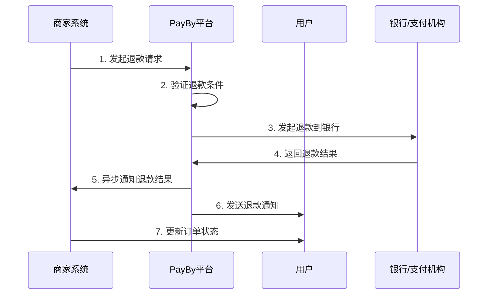

# PayBy退款处理指南

## 概述

PayBy平台提供完整的退款处理功能，支持全额退款、部分退款等多种退款场景，确保商家和用户的资金安全。

**适用场景**: 订单退款、部分退款、批量退款  
**退款类型**: 全额退款、部分退款、自动退款

## 退款流程



## 技术实现

### 1. 环境准备

#### API认证配置
所有API请求都需要使用私钥进行签名认证。

#### 请求头设置
```
Content-Type: application/json
X-PayBy-Signature: {签名}
X-PayBy-Timestamp: {时间戳}
```

### 2. 创建退款订单

#### 全额退款
```bash
curl -X POST https://api.payby.com/v1/refunds \
  -H "Content-Type: application/json" \
  -H "X-PayBy-Signature: {签名}" \
  -H "X-PayBy-Timestamp: {时间戳}" \
  -d '{
    "merchantRefundNo": "REFUND_123456",
    "merchantOrderNo": "ORDER_123456",
    "refundAmount": {
        "currency": "AED",
        "amount": "299.99"
    },
    "refundReason": "客户取消订单",
    "notifyUrl": "https://yoursite.com/api/payby/refund-notification",
    "accessoryContent": {
        "refundDetail": {
            "refundType": "FULL",
            "originalAmount": {
                "currency": "AED",
                "amount": "299.99"
            }
        }
    }
  }'
```

#### 部分退款
```php
<?php
try {
    $refund_no = generateRefundNo();
    
    $refund = \PayBy\Api\Refund::placeOrder([
        "merchantRefundNo" => $refund_no,
        "merchantOrderNo" => "ORDER_123456", // 原订单号
        "refundAmount" => [
            'currency' => 'AED',
            'amount' => '50.00', // 部分退款金额
        ],
        "refundReason" => "商品质量问题，部分退款",
        "notifyUrl" => "https://yoursite.com/api/payby/refund-notification",
        "accessoryContent" => [
            'refundDetail' => [
                'refundType' => 'PARTIAL', // 部分退款
                'originalAmount' => [
                    'currency' => 'AED',
                    'amount' => '299.99',
                ],
                'remainingAmount' => [
                    'currency' => 'AED',
                    'amount' => '249.99',
                ],
                'refundItems' => [
                    [
                        'itemId' => 'ITEM_001',
                        'itemName' => '损坏的商品',
                        'quantity' => 1,
                        'refundAmount' => [
                            'currency' => 'AED',
                            'amount' => '50.00',
                        ],
                    ],
                ],
            ],
        ],
    ]);
    
    print_r($refund);
    
} catch (\PayBy\Error\Base $e) {
    handleRefundError($e);
}
```

#### 退款参数说明

| 参数名 | 类型 | 必填 | 说明 |
|--------|------|------|------|
| merchantRefundNo | string | 是 | 商户退款号，唯一标识 |
| merchantOrderNo | string | 是 | 原订单号 |
| refundAmount | object | 是 | 退款金额 |
| refundReason | string | 是 | 退款原因 |
| notifyUrl | string | 是 | 异步通知URL |
| accessoryContent | object | 否 | 附加信息 |

### 3. 查询退款状态

#### 查询退款订单
```bash
curl -X GET https://api.payby.com/v1/refunds/{refundId} \
  -H "Content-Type: application/json" \
  -H "X-PayBy-Signature: {签名}" \
  -H "X-PayBy-Timestamp: {时间戳}"
```

#### 批量查询退款
```php
<?php
// 批量查询退款状态
function batchGetRefundStatus($refundIds) {
    $results = [];
    
    foreach ($refundIds as $refundId) {
        try {
            $refund = \PayBy\Api\Refund::getOrder($refundId);
            $results[$refundId] = $refund;
        } catch (\PayBy\Error\Base $e) {
            $results[$refundId] = ['error' => $e->getMessage()];
        }
    }
    
    return $results;
}

// 使用示例
$refundIds = ['REFUND_001', 'REFUND_002', 'REFUND_003'];
$batchResults = batchGetRefundStatus($refundIds);
print_r($batchResults);
```

### 4. 异步通知处理

#### 退款通知接口
```php
<?php
// /api/payby/refund-notification.php

// 验证签名
function verifyRefundSignature($data, $signature) {
    // TODO: 实现签名验证逻辑
    return true;
}

// 处理退款异步通知
if ($_SERVER['REQUEST_METHOD'] === 'POST') {
    $input = file_get_contents('php://input');
    $data = json_decode($input, true);
    
    // 验证签名
    $signature = $_SERVER['HTTP_X_PAYBY_SIGNATURE'] ?? '';
    if (!verifyRefundSignature($data, $signature)) {
        http_response_code(400);
        echo json_encode(['error' => 'Invalid signature']);
        exit;
    }
    
    // 处理退款结果
    $refundId = $data['refundId'];
    $merchantRefundNo = $data['merchantRefundNo'];
    $merchantOrderNo = $data['merchantOrderNo'];
    $status = $data['status'];
    $refundAmount = $data['refundAmount'];
    
    switch ($status) {
        case 'SUCCESS':
            // 退款成功处理
            processRefundSuccess($merchantRefundNo, $merchantOrderNo, $refundAmount);
            break;
            
        case 'FAILED':
            // 退款失败处理
            processRefundFailure($merchantRefundNo, $merchantOrderNo, $data['failureReason'] ?? '');
            break;
            
        case 'PROCESSING':
            // 退款处理中
            processRefundProcessing($merchantRefundNo, $merchantOrderNo);
            break;
    }
    
    // 返回成功响应
    echo json_encode(['status' => 'success']);
}

function processRefundSuccess($merchantRefundNo, $merchantOrderNo, $refundAmount) {
    // 更新退款状态
    updateRefundStatus($merchantRefundNo, 'success');
    
    // 更新订单状态
    updateOrderRefundStatus($merchantOrderNo, $refundAmount);
    
    // 记录退款日志
    logRefundSuccess($merchantRefundNo, $merchantOrderNo, $refundAmount);
    
    // 发送退款成功通知
    sendRefundSuccessNotification($merchantOrderNo, $refundAmount);
    
    // 触发后续业务逻辑
    triggerPostRefundActions($merchantOrderNo, $refundAmount);
}

function processRefundFailure($merchantRefundNo, $merchantOrderNo, $failureReason) {
    // 更新退款状态
    updateRefundStatus($merchantRefundNo, 'failed');
    
    // 记录失败原因
    logRefundFailure($merchantRefundNo, $failureReason);
    
    // 发送退款失败通知
    sendRefundFailureNotification($merchantOrderNo, $failureReason);
}
```

### 5. 退款管理功能

#### 退款状态管理
```php
<?php
// 退款状态枚举
class RefundStatus {
    const PENDING = 'pending';      // 待处理
    const PROCESSING = 'processing'; // 处理中
    const SUCCESS = 'success';      // 退款成功
    const FAILED = 'failed';        // 退款失败
    const CANCELLED = 'cancelled';  // 已取消
}

// 更新退款状态
function updateRefundStatus($refundNo, $status, $additionalData = []) {
    $updateData = [
        'status' => $status,
        'updated_at' => date('Y-m-d H:i:s'),
    ];
    
    if (!empty($additionalData)) {
        $updateData = array_merge($updateData, $additionalData);
    }
    
    // 更新数据库
    $db->update('refunds', $updateData, ['refund_no' => $refundNo]);
    
    // 记录状态变更日志
    logRefundStatusChange($refundNo, $status, $additionalData);
}
```

#### 退款金额验证
```php
<?php
// 验证退款金额
function validateRefundAmount($orderNo, $refundAmount) {
    $order = getOrderByNo($orderNo);
    
    if (!$order) {
        throw new Exception('Order not found');
    }
    
    // 检查订单是否已支付
    if ($order['status'] !== 'paid') {
        throw new Exception('Order is not paid');
    }
    
    // 检查退款金额是否超过订单金额
    if ($refundAmount > $order['total_amount']) {
        throw new Exception('Refund amount exceeds order amount');
    }
    
    // 检查是否已退款
    $totalRefunded = getTotalRefundedAmount($orderNo);
    $remainingAmount = $order['total_amount'] - $totalRefunded;
    
    if ($refundAmount > $remainingAmount) {
        throw new Exception('Refund amount exceeds remaining amount');
    }
    
    return true;
}

// 获取已退款总金额
function getTotalRefundedAmount($orderNo) {
    $refunds = $db->select('refunds', [
        'refund_amount'
    ], [
        'order_no' => $orderNo,
        'status' => RefundStatus::SUCCESS
    ]);
    
    $totalRefunded = 0;
    foreach ($refunds as $refund) {
        $totalRefunded += $refund['refund_amount'];
    }
    
    return $totalRefunded;
}
```

### 6. 自动退款处理

#### 自动退款规则
```php
<?php
// 自动退款规则配置
$autoRefundRules = [
    'order_cancelled' => [
        'enabled' => true,
        'delay_minutes' => 0, // 立即退款
        'refund_type' => 'FULL',
    ],
    'delivery_failed' => [
        'enabled' => true,
        'delay_minutes' => 24 * 60, // 24小时后退款
        'refund_type' => 'FULL',
    ],
    'quality_issue' => [
        'enabled' => true,
        'delay_minutes' => 0,
        'refund_type' => 'PARTIAL',
        'refund_percentage' => 50, // 退款50%
    ],
];

// 自动退款处理
function processAutoRefund($orderNo, $reason) {
    $rule = $autoRefundRules[$reason] ?? null;
    
    if (!$rule || !$rule['enabled']) {
        return false;
    }
    
    $order = getOrderByNo($orderNo);
    if (!$order) {
        return false;
    }
    
    // 计算退款金额
    $refundAmount = $order['total_amount'];
    if ($rule['refund_type'] === 'PARTIAL') {
        $refundAmount = $order['total_amount'] * ($rule['refund_percentage'] / 100);
    }
    
    // 创建自动退款
    $refundData = [
        "merchantRefundNo" => generateRefundNo(),
        "merchantOrderNo" => $orderNo,
        "refundAmount" => [
            'currency' => 'AED',
            'amount' => number_format($refundAmount, 2, '.', ''),
        ],
        "refundReason" => "自动退款: " . $reason,
        "notifyUrl" => "https://yoursite.com/api/payby/refund-notification",
        "accessoryContent" => [
            'refundDetail' => [
                'refundType' => $rule['refund_type'],
                'autoRefund' => true,
                'triggerReason' => $reason,
            ],
        ],
    ];
    
    try {
        $refund = \PayBy\Api\Refund::placeOrder($refundData);
        return $refund;
    } catch (\PayBy\Error\Base $e) {
        logAutoRefundError($orderNo, $reason, $e->getMessage());
        return false;
    }
}
```

### 7. 退款统计报表

#### 退款统计功能
```php
<?php
// 退款统计
function getRefundStatistics($startDate, $endDate) {
    $stats = [
        'total_refunds' => 0,
        'total_amount' => 0,
        'successful_refunds' => 0,
        'failed_refunds' => 0,
        'pending_refunds' => 0,
        'refund_reasons' => [],
    ];
    
    $refunds = $db->select('refunds', '*', [
        'created_at[>=]' => $startDate,
        'created_at[<=]' => $endDate,
    ]);
    
    foreach ($refunds as $refund) {
        $stats['total_refunds']++;
        $stats['total_amount'] += $refund['refund_amount'];
        
        switch ($refund['status']) {
            case RefundStatus::SUCCESS:
                $stats['successful_refunds']++;
                break;
            case RefundStatus::FAILED:
                $stats['failed_refunds']++;
                break;
            case RefundStatus::PENDING:
            case RefundStatus::PROCESSING:
                $stats['pending_refunds']++;
                break;
        }
        
        // 统计退款原因
        $reason = $refund['refund_reason'];
        if (!isset($stats['refund_reasons'][$reason])) {
            $stats['refund_reasons'][$reason] = 0;
        }
        $stats['refund_reasons'][$reason]++;
    }
    
    return $stats;
}

// 生成退款报表
function generateRefundReport($startDate, $endDate) {
    $stats = getRefundStatistics($startDate, $endDate);
    
    $report = [
        'period' => [
            'start_date' => $startDate,
            'end_date' => $endDate,
        ],
        'summary' => [
            'total_refunds' => $stats['total_refunds'],
            'total_amount' => number_format($stats['total_amount'], 2),
            'success_rate' => $stats['total_refunds'] > 0 ? 
                round(($stats['successful_refunds'] / $stats['total_refunds']) * 100, 2) : 0,
        ],
        'details' => $stats,
    ];
    
    return $report;
}
```

## 最佳实践

### 1. 退款策略制定
```php
<?php
// 退款策略配置
$refundPolicies = [
    'electronics' => [
        'return_window_days' => 14,
        'refund_method' => 'original_payment',
        'restocking_fee' => 0.05, // 5%手续费
    ],
    'clothing' => [
        'return_window_days' => 30,
        'refund_method' => 'original_payment',
        'restocking_fee' => 0,
    ],
    'food' => [
        'return_window_days' => 0,
        'refund_method' => 'store_credit',
        'restocking_fee' => 0,
    ],
];

// 检查退款资格
function checkRefundEligibility($orderNo) {
    $order = getOrderByNo($orderNo);
    $category = $order['category'];
    $policy = $refundPolicies[$category] ?? $refundPolicies['default'];
    
    $orderDate = new DateTime($order['created_at']);
    $now = new DateTime();
    $daysDiff = $now->diff($orderDate)->days;
    
    if ($daysDiff > $policy['return_window_days']) {
        return [
            'eligible' => false,
            'reason' => '超出退款期限',
        ];
    }
    
    return [
        'eligible' => true,
        'policy' => $policy,
    ];
}
```

### 2. 退款通知管理
```php
<?php
// 发送退款通知
function sendRefundNotification($orderNo, $refundAmount, $status) {
    $order = getOrderByNo($orderNo);
    $user = getUserById($order['user_id']);
    
    $notificationData = [
        'user_id' => $order['user_id'],
        'order_no' => $orderNo,
        'refund_amount' => $refundAmount,
        'status' => $status,
        'notification_type' => 'refund',
    ];
    
    // 发送邮件通知
    if ($user['email']) {
        sendRefundEmail($user['email'], $notificationData);
    }
    
    // 发送短信通知
    if ($user['phone']) {
        sendRefundSMS($user['phone'], $notificationData);
    }
    
    // 发送应用内通知
    sendInAppNotification($user['id'], $notificationData);
    
    // 记录通知日志
    logNotification($notificationData);
}

// 退款邮件模板
function sendRefundEmail($email, $data) {
    $subject = '退款通知 - 订单 ' . $data['order_no'];
    $body = "
    <h2>退款通知</h2>
    <p>尊敬的客户，</p>
    <p>您的订单 {$data['order_no']} 已成功退款。</p>
    <p>退款金额: AED {$data['refund_amount']}</p>
    <p>退款状态: {$data['status']}</p>
    <p>退款将在3-5个工作日内到账。</p>
    <p>如有疑问，请联系客服。</p>
    ";
    
    // 发送邮件
    sendEmail($email, $subject, $body);
}
```

### 3. 退款监控告警
```php
<?php
// 退款监控
function monitorRefunds() {
    // 检查异常退款
    $suspiciousRefunds = $db->select('refunds', '*', [
        'refund_amount[>]' => 1000, // 大额退款
        'status' => RefundStatus::SUCCESS,
        'created_at[>=]' => date('Y-m-d H:i:s', strtotime('-1 hour')),
    ]);
    
    foreach ($suspiciousRefunds as $refund) {
        sendRefundAlert($refund);
    }
    
    // 检查退款失败率
    $recentRefunds = $db->select('refunds', '*', [
        'created_at[>=]' => date('Y-m-d H:i:s', strtotime('-24 hours')),
    ]);
    
    $failedCount = 0;
    foreach ($recentRefunds as $refund) {
        if ($refund['status'] === RefundStatus::FAILED) {
            $failedCount++;
        }
    }
    
    $failureRate = count($recentRefunds) > 0 ? ($failedCount / count($recentRefunds)) * 100 : 0;
    
    if ($failureRate > 10) { // 失败率超过10%
        sendHighFailureRateAlert($failureRate);
    }
}

// 发送退款告警
function sendRefundAlert($refund) {
    $alertData = [
        'type' => 'large_refund',
        'refund_no' => $refund['refund_no'],
        'order_no' => $refund['order_no'],
        'amount' => $refund['refund_amount'],
        'reason' => $refund['refund_reason'],
        'timestamp' => $refund['created_at'],
    ];
    
    // 发送告警通知
    sendAlertNotification($alertData);
}
```

## 测试环境

### 测试配置
```php
<?php
// 测试环境配置
\PayBy\PayBy::setPrivateKey('TEST_PRIVATE_KEY');
\PayBy\PayBy::setApiBase('https://test-api.payby.com');

// 测试退款场景
$testRefundScenarios = [
    'full_refund' => [
        'order_no' => 'TEST_ORDER_001',
        'refund_amount' => '100.00',
        'reason' => '客户取消订单',
    ],
    'partial_refund' => [
        'order_no' => 'TEST_ORDER_002',
        'refund_amount' => '50.00',
        'reason' => '商品质量问题',
    ],
    'refund_failure' => [
        'order_no' => 'TEST_ORDER_003',
        'refund_amount' => '200.00',
        'reason' => '测试退款失败',
    ],
];
```

### 测试用例
1. **全额退款测试**
2. **部分退款测试**
3. **退款失败测试**
4. **批量退款测试**
5. **自动退款测试**
6. **退款通知测试**
7. **退款统计测试**

## 常见问题

### Q1: 退款申请失败
**A**: 检查原订单状态，确认订单已支付且未超过退款期限。

### Q2: 退款金额不正确
**A**: 验证退款金额不超过订单金额，检查是否已存在其他退款。

### Q3: 退款到账时间
**A**: 退款通常在3-5个工作日内到账，具体时间取决于银行处理速度。

### Q4: 退款状态查询失败
**A**: 确认退款ID格式正确，检查网络连接和API权限。

## 相关接口文档

- **创建退款**: https://developers.payby.com/docs/api/refunds/create
- **查询退款**: https://developers.payby.com/docs/api/refunds/retrieve
- **退款通知**: https://developers.payby.com/docs/api/refund-notifications
- **退款统计**: https://developers.payby.com/docs/api/refund-statistics

## 技术支持

- **开发者文档**: https://developers.payby.com/docs
- **API文档**: https://developers.payby.com/docs/api
- **技术支持**: support@payby.com 