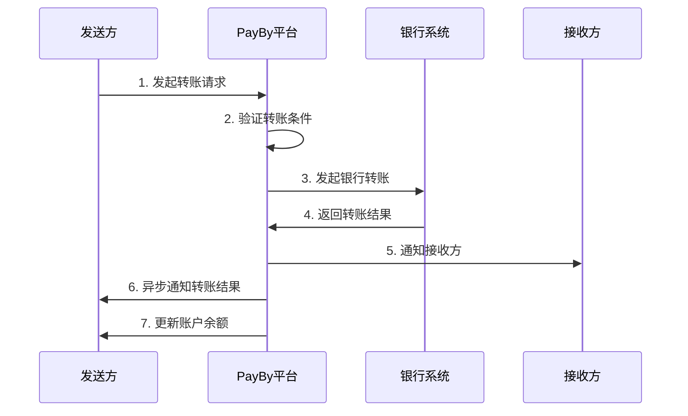

# PayBy转账服务指南

## 概述

PayBy转账服务提供账户间转账和银行转账功能，支持个人用户和企业用户的资金转移需求。

**适用场景**: 账户转账、银行转账、批量转账  
**转账类型**: 内部转账、银行转账、跨境转账

## 转账流程



## 技术实现

### 1. 环境准备

#### API认证配置
所有API请求都需要使用私钥进行签名认证。

#### 请求头设置
```
Content-Type: application/json
X-PayBy-Signature: {签名}
X-PayBy-Timestamp: {时间戳}
```

### 2. 内部转账

#### 账户间转账
```bash
curl -X POST https://api.payby.com/v1/transfers \
  -H "Content-Type: application/json" \
  -H "X-PayBy-Signature: {签名}" \
  -H "X-PayBy-Timestamp: {时间戳}" \
  -d '{
    "merchantTransferNo": "TRANSFER_123456",
    "fromAccount": "SENDER_ACCOUNT_ID",
    "toAccount": "RECEIVER_ACCOUNT_ID",
    "transferAmount": {
        "currency": "AED",
        "amount": "1000.00"
    },
    "transferReason": "业务往来",
    "notifyUrl": "https://yoursite.com/api/payby/transfer-notification",
    "accessoryContent": {
        "transferDetail": {
            "transferType": "INTERNAL",
            "priority": "NORMAL",
            "memo": "转账备注信息"
        },
        "senderDetail": {
            "senderName": "张三",
            "senderPhone": "+971501234567",
            "senderEmail": "zhangsan@example.com"
        },
        "receiverDetail": {
            "receiverName": "李四",
            "receiverPhone": "+971509876543",
            "receiverEmail": "lisi@example.com"
        }
    }
  }'
```

#### 批量转账
```php
<?php
try {
    $batch_transfer_no = generateBatchTransferNo();
    
    $batchTransfer = \PayBy\Api\Transfer::placeBatchTransferOrder([
        "merchantBatchTransferNo" => $batch_transfer_no,
        "fromAccount" => "SENDER_ACCOUNT_ID",
        "transfers" => [
            [
                "merchantTransferNo" => generateTransferNo(),
                "toAccount" => "RECEIVER_001",
                "transferAmount" => [
                    'currency' => 'AED',
                    'amount' => '500.00',
                ],
                "transferReason" => "工资发放",
                "memo" => "1月工资",
            ],
            [
                "merchantTransferNo" => generateTransferNo(),
                "toAccount" => "RECEIVER_002",
                "transferAmount" => [
                    'currency' => 'AED',
                    'amount' => '800.00',
                ],
                "transferReason" => "工资发放",
                "memo" => "1月工资",
            ],
        ],
        "notifyUrl" => "https://yoursite.com/api/payby/batch-transfer-notification",
        "accessoryContent" => [
            'batchDetail' => [
                'batchType' => 'SALARY',
                'totalAmount' => [
                    'currency' => 'AED',
                    'amount' => '1300.00',
                ],
                'totalCount' => 2,
            ],
        ],
    ]);
    
    print_r($batchTransfer);
    
} catch (\PayBy\Error\Base $e) {
    handleTransferError($e);
}
```

### 3. 银行转账

#### 银行转账订单
```php
<?php
try {
    $transfer_no = generateTransferNo();
    
    $bankTransfer = \PayBy\Api\Transfer::placeTransferToBankOrder([
        "merchantTransferNo" => $transfer_no,
        "fromAccount" => "SENDER_ACCOUNT_ID",
        "bankTransferInfo" => [
            "bankCode" => "ENBD", // 银行代码
            "accountNumber" => "1234567890",
            "accountName" => "李四",
            "swiftCode" => "EBILAEAD", // SWIFT代码
            "iban" => "AE123456789012345678901", // IBAN号码
        ],
        "transferAmount" => [
            'currency' => 'AED',
            'amount' => '5000.00',
        ],
        "transferReason" => "投资理财",
        "notifyUrl" => "https://yoursite.com/api/payby/bank-transfer-notification",
        "accessoryContent" => [
            'bankTransferDetail' => [
                'transferType' => 'BANK_TRANSFER',
                'priority' => 'NORMAL',
                'expectedArrivalTime' => '2-3 business days',
                'fee' => [
                    'currency' => 'AED',
                    'amount' => '25.00',
                ],
            ],
            'senderDetail' => [
                'senderName' => '张三',
                'senderPhone' => '+971501234567',
                'senderEmail' => 'zhangsan@example.com',
                'senderAddress' => [
                    'country' => 'AE',
                    'state' => 'Dubai',
                    'city' => 'Dubai',
                    'address' => '123 Main Street',
                    'postalCode' => '12345',
                ],
            ],
        ],
    ]);
    
    print_r($bankTransfer);
    
} catch (\PayBy\Error\Base $e) {
    handleTransferError($e);
}
```

#### 跨境转账
```php
<?php
try {
    $transfer_no = generateTransferNo();
    
    $internationalTransfer = \PayBy\Api\Transfer::placeTransferToBankOrder([
        "merchantTransferNo" => $transfer_no,
        "fromAccount" => "SENDER_ACCOUNT_ID",
        "bankTransferInfo" => [
            "bankCode" => "CITI", // 花旗银行
            "accountNumber" => "9876543210",
            "accountName" => "John Smith",
            "swiftCode" => "CITIUS33",
            "iban" => "US123456789012345678901",
            "bankCountry" => "US",
            "bankAddress" => "399 Park Avenue, New York, NY 10022",
        ],
        "transferAmount" => [
            'currency' => 'USD',
            'amount' => '10000.00',
        ],
        "transferReason" => "海外投资",
        "notifyUrl" => "https://yoursite.com/api/payby/international-transfer-notification",
        "accessoryContent" => [
            'internationalTransferDetail' => [
                'transferType' => 'INTERNATIONAL',
                'priority' => 'URGENT',
                'expectedArrivalTime' => '1-2 business days',
                'exchangeRate' => '3.67', // AED to USD
                'fee' => [
                    'currency' => 'AED',
                    'amount' => '100.00',
                ],
                'correspondentBank' => [
                    'bankName' => 'Correspondent Bank',
                    'swiftCode' => 'CORRUS33',
                ],
            ],
        ],
    ]);
    
    print_r($internationalTransfer);
    
} catch (\PayBy\Error\Base $e) {
    handleTransferError($e);
}
```

### 4. 查询转账状态

#### 查询转账订单
```php
<?php
// 查询转账状态
function getTransferStatus($transferId) {
    // 调用API查询内部转账状态
    return queryTransferStatus($transferId);
}

// 查询银行转账状态
function getBankTransferStatus($transferId) {
    // 调用API查询银行转账状态
    return queryBankTransferStatus($transferId);
}

// 使用示例
$transferStatus = getTransferStatus('PAYBY_TRANSFER_ID');
$bankTransferStatus = getBankTransferStatus('PAYBY_BANK_TRANSFER_ID');
```

### 5. 异步通知处理

#### 转账通知接口
```php
<?php
// /api/payby/transfer-notification.php

// 验证签名
function verifyTransferSignature($data, $signature) {
    // TODO: 实现签名验证逻辑
    return true;
}

// 处理转账异步通知
if ($_SERVER['REQUEST_METHOD'] === 'POST') {
    $input = file_get_contents('php://input');
    $data = json_decode($input, true);
    
    // 验证签名
    $signature = $_SERVER['HTTP_X_PAYBY_SIGNATURE'] ?? '';
    if (!verifyTransferSignature($data, $signature)) {
        http_response_code(400);
        echo json_encode(['error' => 'Invalid signature']);
        exit;
    }
    
    // 处理转账结果
    $transferId = $data['transferId'];
    $merchantTransferNo = $data['merchantTransferNo'];
    $status = $data['status'];
    $transferAmount = $data['transferAmount'];
    $transferType = $data['transferType'] ?? '';
    
    switch ($status) {
        case 'SUCCESS':
            // 转账成功处理
            processTransferSuccess($merchantTransferNo, $transferId, $transferAmount, $transferType);
            break;
            
        case 'FAILED':
            // 转账失败处理
            processTransferFailure($merchantTransferNo, $transferId, $data['failureReason'] ?? '');
            break;
            
        case 'PROCESSING':
            // 转账处理中
            processTransferProcessing($merchantTransferNo, $transferId);
            break;
            
        case 'PENDING':
            // 转账待处理
            processTransferPending($merchantTransferNo, $transferId);
            break;
    }
    
    // 返回成功响应
    echo json_encode(['status' => 'success']);
}

function processTransferSuccess($merchantTransferNo, $transferId, $transferAmount, $transferType) {
    // 更新转账状态
    updateTransferStatus($merchantTransferNo, 'success');
    
    // 更新账户余额
    updateAccountBalance($merchantTransferNo, $transferAmount);
    
    // 记录转账日志
    logTransferSuccess($merchantTransferNo, $transferId, $transferAmount, $transferType);
    
    // 发送转账成功通知
    sendTransferSuccessNotification($merchantTransferNo, $transferAmount);
    
    // 触发后续业务逻辑
    triggerPostTransferActions($merchantTransferNo, $transferAmount);
}

function processTransferFailure($merchantTransferNo, $transferId, $failureReason) {
    // 更新转账状态
    updateTransferStatus($merchantTransferNo, 'failed');
    
    // 记录失败原因
    logTransferFailure($merchantTransferNo, $failureReason);
    
    // 发送转账失败通知
    sendTransferFailureNotification($merchantTransferNo, $failureReason);
    
    // 退款处理（如果已扣款）
    processTransferRefund($merchantTransferNo);
}
```

### 6. 转账限额管理

#### 限额配置
```php
<?php
// 转账限额配置
$transferLimits = [
    'daily' => [
        'internal' => 50000, // 内部转账日限额
        'bank' => 100000,    // 银行转账日限额
        'international' => 50000, // 跨境转账日限额
    ],
    'monthly' => [
        'internal' => 500000,
        'bank' => 1000000,
        'international' => 500000,
    ],
    'single' => [
        'internal' => 10000,
        'bank' => 50000,
        'international' => 25000,
    ],
];

// 检查转账限额
function checkTransferLimit($accountId, $amount, $transferType) {
    $account = getAccountById($accountId);
    
    // 检查单笔限额
    if ($amount > $transferLimits['single'][$transferType]) {
        throw new Exception('Transfer amount exceeds single transfer limit');
    }
    
    // 检查日限额
    $dailyTransferred = getDailyTransferredAmount($accountId, $transferType);
    if (($dailyTransferred + $amount) > $transferLimits['daily'][$transferType]) {
        throw new Exception('Transfer amount exceeds daily limit');
    }
    
    // 检查月限额
    $monthlyTransferred = getMonthlyTransferredAmount($accountId, $transferType);
    if (($monthlyTransferred + $amount) > $transferLimits['monthly'][$transferType]) {
        throw new Exception('Transfer amount exceeds monthly limit');
    }
    
    return true;
}

// 获取日转账金额
function getDailyTransferredAmount($accountId, $transferType) {
    $today = date('Y-m-d');
    
    $transfers = $db->select('transfers', [
        'transfer_amount'
    ], [
        'from_account' => $accountId,
        'transfer_type' => $transferType,
        'status' => 'success',
        'created_at[>=]' => $today . ' 00:00:00',
        'created_at[<=]' => $today . ' 23:59:59',
    ]);
    
    $totalAmount = 0;
    foreach ($transfers as $transfer) {
        $totalAmount += $transfer['transfer_amount'];
    }
    
    return $totalAmount;
}
```

### 7. 转账费用计算

#### 费用计算逻辑
```php
<?php
// 转账费用配置
$transferFees = [
    'internal' => [
        'fixed_fee' => 0,
        'percentage_fee' => 0,
        'min_fee' => 0,
        'max_fee' => 0,
    ],
    'bank' => [
        'fixed_fee' => 25,
        'percentage_fee' => 0,
        'min_fee' => 25,
        'max_fee' => 100,
    ],
    'international' => [
        'fixed_fee' => 100,
        'percentage_fee' => 0.001, // 0.1%
        'min_fee' => 100,
        'max_fee' => 500,
    ],
];

// 计算转账费用
function calculateTransferFee($amount, $transferType, $currency = 'AED') {
    $feeConfig = $transferFees[$transferType];
    
    // 固定费用
    $fixedFee = $feeConfig['fixed_fee'];
    
    // 百分比费用
    $percentageFee = $amount * $feeConfig['percentage_fee'];
    
    // 总费用
    $totalFee = $fixedFee + $percentageFee;
    
    // 应用最小和最大费用限制
    $totalFee = max($totalFee, $feeConfig['min_fee']);
    $totalFee = min($totalFee, $feeConfig['max_fee']);
    
    return [
        'fee_amount' => $totalFee,
        'fee_currency' => $currency,
        'breakdown' => [
            'fixed_fee' => $fixedFee,
            'percentage_fee' => $percentageFee,
        ],
    ];
}

// 计算实际到账金额
function calculateNetAmount($grossAmount, $transferType) {
    $fee = calculateTransferFee($grossAmount, $transferType);
    $netAmount = $grossAmount - $fee['fee_amount'];
    
    return [
        'gross_amount' => $grossAmount,
        'fee_amount' => $fee['fee_amount'],
        'net_amount' => $netAmount,
        'fee_breakdown' => $fee['breakdown'],
    ];
}
```

## 最佳实践

### 1. 转账安全验证
```php
<?php
// 转账安全验证
function validateTransfer($fromAccount, $toAccount, $amount, $transferType) {
    // 验证账户状态
    $fromAccountInfo = getAccountById($fromAccount);
    $toAccountInfo = getAccountById($toAccount);
    
    if (!$fromAccountInfo || $fromAccountInfo['status'] !== 'active') {
        throw new Exception('Invalid sender account');
    }
    
    if (!$toAccountInfo || $toAccountInfo['status'] !== 'active') {
        throw new Exception('Invalid receiver account');
    }
    
    // 验证余额
    if ($fromAccountInfo['balance'] < $amount) {
        throw new Exception('Insufficient balance');
    }
    
    // 验证转账限额
    checkTransferLimit($fromAccount, $amount, $transferType);
    
    // 验证风险控制
    checkRiskControl($fromAccount, $toAccount, $amount);
    
    return true;
}

// 风险控制检查
function checkRiskControl($fromAccount, $toAccount, $amount) {
    // 检查可疑交易
    $suspiciousPatterns = [
        'large_amount' => $amount > 10000,
        'frequent_transfer' => isFrequentTransfer($fromAccount),
        'new_receiver' => isNewReceiver($fromAccount, $toAccount),
        'unusual_time' => isUnusualTransferTime(),
    ];
    
    $riskScore = 0;
    foreach ($suspiciousPatterns as $pattern => $isSuspicious) {
        if ($isSuspicious) {
            $riskScore += 25; // 每个可疑模式增加25分
        }
    }
    
    if ($riskScore >= 50) {
        // 高风险交易，需要人工审核
        requireManualReview($fromAccount, $toAccount, $amount, $riskScore);
    }
}
```

### 2. 转账状态管理
```php
<?php
// 转账状态枚举
class TransferStatus {
    const PENDING = 'pending';      // 待处理
    const PROCESSING = 'processing'; // 处理中
    const SUCCESS = 'success';      // 转账成功
    const FAILED = 'failed';        // 转账失败
    const CANCELLED = 'cancelled';  // 已取消
    const REVIEW = 'review';        // 审核中
}

// 更新转账状态
function updateTransferStatus($transferNo, $status, $additionalData = []) {
    $updateData = [
        'status' => $status,
        'updated_at' => date('Y-m-d H:i:s'),
    ];
    
    if (!empty($additionalData)) {
        $updateData = array_merge($updateData, $additionalData);
    }
    
    // 更新数据库
    $db->update('transfers', $updateData, ['transfer_no' => $transferNo]);
    
    // 记录状态变更日志
    logTransferStatusChange($transferNo, $status, $additionalData);
    
    // 如果是成功状态，更新账户余额
    if ($status === TransferStatus::SUCCESS) {
        updateAccountBalances($transferNo);
    }
}

// 更新账户余额
function updateAccountBalances($transferNo) {
    $transfer = getTransferByNo($transferNo);
    
    // 扣除发送方余额
    $db->update('accounts', [
        'balance' => $db->raw('balance - ' . $transfer['transfer_amount']),
        'updated_at' => date('Y-m-d H:i:s'),
    ], ['account_id' => $transfer['from_account']]);
    
    // 增加接收方余额
    $db->update('accounts', [
        'balance' => $db->raw('balance + ' . $transfer['transfer_amount']),
        'updated_at' => date('Y-m-d H:i:s'),
    ], ['account_id' => $transfer['to_account']]);
}
```

### 3. 转账通知管理
```php
<?php
// 发送转账通知
function sendTransferNotification($transferNo, $status, $amount) {
    $transfer = getTransferByNo($transferNo);
    $sender = getUserById($transfer['from_account']);
    $receiver = getUserById($transfer['to_account']);
    
    $notificationData = [
        'transfer_no' => $transferNo,
        'amount' => $amount,
        'status' => $status,
        'transfer_type' => $transfer['transfer_type'],
    ];
    
    // 发送方通知
    if ($sender['email']) {
        sendTransferEmail($sender['email'], $notificationData, 'sender');
    }
    
    if ($sender['phone']) {
        sendTransferSMS($sender['phone'], $notificationData, 'sender');
    }
    
    // 接收方通知
    if ($receiver['email']) {
        sendTransferEmail($receiver['email'], $notificationData, 'receiver');
    }
    
    if ($receiver['phone']) {
        sendTransferSMS($receiver['phone'], $notificationData, 'receiver');
    }
    
    // 记录通知日志
    logTransferNotification($transferNo, $notificationData);
}

// 转账邮件模板
function sendTransferEmail($email, $data, $role) {
    if ($role === 'sender') {
        $subject = '转账成功通知 - ' . $data['transfer_no'];
        $body = "
        <h2>转账成功</h2>
        <p>您的转账已成功完成。</p>
        <p>转账编号: {$data['transfer_no']}</p>
        <p>转账金额: AED {$data['amount']}</p>
        <p>转账状态: {$data['status']}</p>
        ";
    } else {
        $subject = '收到转账通知 - ' . $data['transfer_no'];
        $body = "
        <h2>收到转账</h2>
        <p>您已收到一笔转账。</p>
        <p>转账编号: {$data['transfer_no']}</p>
        <p>转账金额: AED {$data['amount']}</p>
        <p>转账状态: {$data['status']}</p>
        ";
    }
    
    sendEmail($email, $subject, $body);
}
```

### 4. 转账监控告警
```php
<?php
// 转账监控
function monitorTransfers() {
    // 检查大额转账
    $largeTransfers = $db->select('transfers', '*', [
        'transfer_amount[>]' => 50000,
        'status' => TransferStatus::SUCCESS,
        'created_at[>=]' => date('Y-m-d H:i:s', strtotime('-1 hour')),
    ]);
    
    foreach ($largeTransfers as $transfer) {
        sendLargeTransferAlert($transfer);
    }
    
    // 检查异常转账
    $suspiciousTransfers = $db->select('transfers', '*', [
        'risk_score[>=]' => 75,
        'status' => TransferStatus::SUCCESS,
        'created_at[>=]' => date('Y-m-d H:i:s', strtotime('-24 hours')),
    ]);
    
    foreach ($suspiciousTransfers as $transfer) {
        sendSuspiciousTransferAlert($transfer);
    }
    
    // 检查转账失败率
    $recentTransfers = $db->select('transfers', '*', [
        'created_at[>=]' => date('Y-m-d H:i:s', strtotime('-24 hours')),
    ]);
    
    $failedCount = 0;
    foreach ($recentTransfers as $transfer) {
        if ($transfer['status'] === TransferStatus::FAILED) {
            $failedCount++;
        }
    }
    
    $failureRate = count($recentTransfers) > 0 ? ($failedCount / count($recentTransfers)) * 100 : 0;
    
    if ($failureRate > 5) { // 失败率超过5%
        sendHighFailureRateAlert($failureRate);
    }
}
```

## 测试环境

### 测试配置
```php
<?php
// 测试环境配置
\PayBy\PayBy::setPrivateKey('TEST_PRIVATE_KEY');
\PayBy\PayBy::setApiBase('https://test-api.payby.com');

// 测试转账场景
$testTransferScenarios = [
    'internal_transfer' => [
        'from_account' => 'TEST_ACCOUNT_001',
        'to_account' => 'TEST_ACCOUNT_002',
        'amount' => '1000.00',
        'reason' => '测试内部转账',
    ],
    'bank_transfer' => [
        'from_account' => 'TEST_ACCOUNT_001',
        'bank_info' => [
            'bank_code' => 'TEST_BANK',
            'account_number' => '1234567890',
            'account_name' => 'Test User',
        ],
        'amount' => '5000.00',
        'reason' => '测试银行转账',
    ],
    'international_transfer' => [
        'from_account' => 'TEST_ACCOUNT_001',
        'bank_info' => [
            'bank_code' => 'TEST_INTL_BANK',
            'account_number' => '9876543210',
            'account_name' => 'International User',
            'swift_code' => 'TESTUS33',
            'bank_country' => 'US',
        ],
        'amount' => '10000.00',
        'reason' => '测试跨境转账',
    ],
];
```

### 测试用例
1. **内部转账测试**
2. **银行转账测试**
3. **跨境转账测试**
4. **批量转账测试**
5. **转账限额测试**
6. **转账费用测试**
7. **转账通知测试**

## 常见问题

### Q1: 转账申请失败
**A**: 检查账户余额、转账限额和账户状态。

### Q2: 银行转账到账时间
**A**: 境内转账1-2个工作日，跨境转账1-3个工作日。

### Q3: 转账费用计算
**A**: 费用包括固定费用和百分比费用，具体费率请查看费用配置。

### Q4: 转账状态查询失败
**A**: 确认转账ID格式正确，检查网络连接和API权限。

## 相关接口文档

- **创建转账**: https://developers.payby.com/docs/api/transfers/create
- **查询转账**: https://developers.payby.com/docs/api/transfers/retrieve
- **银行转账**: https://developers.payby.com/docs/api/bank-transfers
- **转账通知**: https://developers.payby.com/docs/api/transfer-notifications

## 技术支持

- **开发者文档**: https://developers.payby.com/docs
- **API文档**: https://developers.payby.com/docs/api
- **技术支持**: support@payby.com 